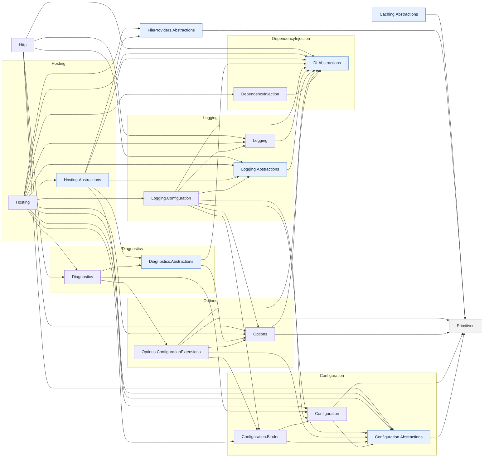

# ME.* dependency map — lite (skeleton)

The same graph as [`me-extensions-dependencies.md`](me-extensions-dependencies.md) with the
concrete **provider / sink / impl leaves** dropped — the architectural skeleton only.

Omitted: Configuration.{CommandLine, EnvironmentVariables, Json, Ini, Xml, UserSecrets,
FileExtensions}, Logging.{Console, Debug, EventLog, EventSource, TraceSource},
FileProviders.{Physical, Composite}, Caching.Memory (and external FileSystemGlobbing).
Kept: each family's core + `.Abstractions`, the Configuration binder, and the cross-family
bridges (Options.ConfigurationExtensions, Logging.Configuration).

See the full map for the provider edges and the complete adjacency list.
