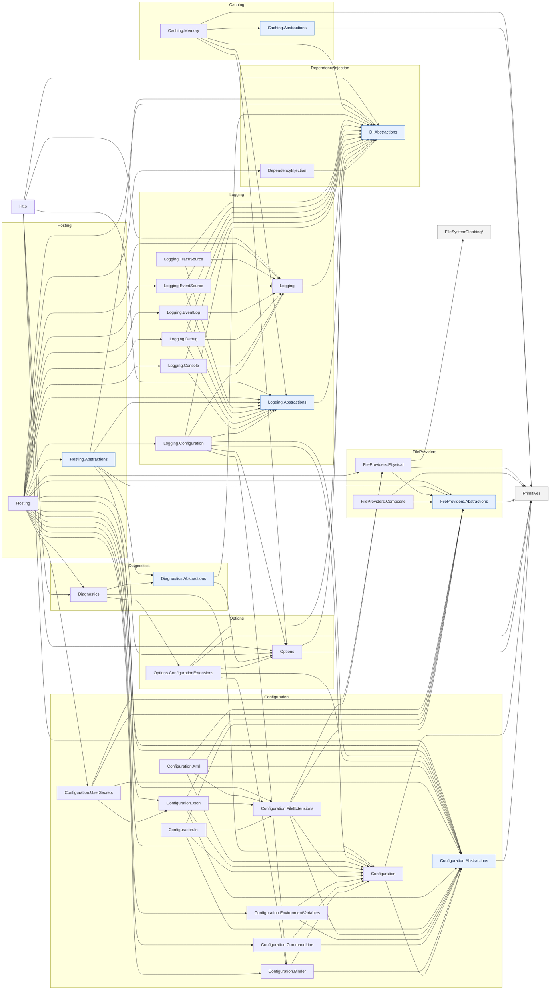

# ME.* dependency map (the structure we mirror)

Source of truth for our package layering. **Governing decision:** mirror this dependency
structure **exactly** for now, and collapse distinctions later only once they're shown to be
unjustified in a TS/no-reflection context (see `../decisions.md` §0).

Extracted from the `.csproj` `<ProjectReference>` / `<Reference>` graph in
the reference runtime's `src/libraries` (`main`).
Edges are "depends on". `.Abstractions` packages are the interface/contract layer.

## Graph



`*` `FileSystemGlobbing` is `ME.FileSystemGlobbing` (outside the queried set).
`Caching` (bare) does not exist — only `Caching.Abstractions` / `Caching.Memory`.

## Adjacency (verbatim; `(c)` = conditional — scoped to `TargetFramework != NetCoreAppCurrent`, i.e. it comes from the shared framework on the current TFM — a real dependency, not optional)

```
Caching.Abstractions        -> Primitives
Caching.Memory              -> Caching.Abstractions(c), DependencyInjection.Abstractions(c), Logging.Abstractions(c), Options(c), Primitives(c)
Configuration               -> Configuration.Abstractions(c), Primitives(c)
Configuration.Abstractions  -> Primitives
Configuration.Binder        -> Configuration, Configuration.Abstractions(c)
Configuration.CommandLine   -> Configuration, Configuration.Abstractions(c)
Configuration.EnvironmentVariables -> Configuration, Configuration.Abstractions(c)
Configuration.FileExtensions -> Configuration, FileProviders.Physical, Configuration.Abstractions(c), FileProviders.Abstractions(c)
Configuration.Ini           -> Configuration, Configuration.FileExtensions, Configuration.Abstractions(c), FileProviders.Abstractions(c)
Configuration.Json          -> Configuration, Configuration.FileExtensions, Configuration.Abstractions(c), FileProviders.Abstractions(c)
Configuration.UserSecrets   -> Configuration.Json, FileProviders.Physical, Configuration.Abstractions(c), FileProviders.Abstractions(c)
Configuration.Xml           -> Configuration, Configuration.FileExtensions, Configuration.Abstractions(c), FileProviders.Abstractions(c)
DependencyInjection         -> DependencyInjection.Abstractions(c)
DependencyInjection.Abstractions -> (none)
Diagnostics                 -> Configuration, Options.ConfigurationExtensions, Diagnostics.Abstractions(c)
Diagnostics.Abstractions    -> DependencyInjection.Abstractions, Options
FileProviders.Abstractions  -> Primitives
FileProviders.Composite     -> FileProviders.Abstractions(c), Primitives(c)
FileProviders.Physical      -> FileSystemGlobbing, FileProviders.Abstractions(c), Primitives(c)
Hosting                     -> Configuration, Configuration.Binder, Configuration.CommandLine, Configuration.EnvironmentVariables, Configuration.FileExtensions, Configuration.Json, Configuration.UserSecrets, DependencyInjection, Diagnostics, FileProviders.Physical, Logging, Logging.Configuration, Logging.Console, Logging.Debug, Logging.EventLog, Logging.EventSource, [+ Abstractions(c): Configuration, DependencyInjection, FileProviders, Hosting, Logging; Options(c)]
Hosting.Abstractions        -> Configuration.Abstractions, DependencyInjection.Abstractions, Diagnostics.Abstractions, FileProviders.Abstractions, Logging.Abstractions
Http                        -> Logging, Diagnostics(c), Configuration.Abstractions(c), DependencyInjection.Abstractions(c), Logging.Abstractions(c), Options(c)
Logging                     -> DependencyInjection.Abstractions
Logging.Abstractions        -> DependencyInjection.Abstractions
Logging.Configuration       -> Configuration.Binder, Configuration, Logging, Configuration.Abstractions(c), DependencyInjection.Abstractions(c), Logging.Abstractions(c), Options(c)
Logging.Console             -> Logging, DependencyInjection.Abstractions(c), Logging.Abstractions(c)
Logging.Debug               -> Logging, DependencyInjection.Abstractions(c), Logging.Abstractions(c)
Logging.EventLog            -> Logging, DependencyInjection.Abstractions(c), Logging.Abstractions(c)
Logging.EventSource         -> Logging, DependencyInjection.Abstractions(c), Logging.Abstractions(c)
Logging.TraceSource         -> Logging, DependencyInjection.Abstractions(c), Logging.Abstractions(c)
Options                     -> DependencyInjection.Abstractions, Primitives
Options.ConfigurationExtensions -> Options(c), Configuration.Binder, Configuration.Abstractions(c), DependencyInjection.Abstractions(c), Primitives(c)
Primitives                  -> (none)
```

## What this pins down for `@rhombus-std` (stop re-deciding — ME already answers)

- **`Options` → `DependencyInjection.Abstractions` + `Primitives`; no Configuration.** ⇒ `@rhombus-std/options` → `di.core` (+ a `Primitives` analog); it is **config-unaware**.
- **`Options.ConfigurationExtensions` → `Options` + `Configuration.Binder` + `Configuration.Abstractions`.** ⇒ `@rhombus-std/options.augmentations` → `options` + config's binder (`bindConfig`) + `config.core`. The **extensions** package — not core Options — is what references config.
- **`Hosting.Abstractions` → the `.Abstractions` of Configuration, DI, Diagnostics, FileProviders, Logging.** ⇒ `@rhombus-std/hosting.core` should depend on the abstraction layers, not the impls.
- **`Hosting` (impl) → the concrete Configuration/DI/Logging/Diagnostics + every config provider.** It is the composition root that pulls everything.
- **`Logging.Abstractions` → `DependencyInjection.Abstractions`.** A future logging family's `logging.core` → `di.core`.
- **`Primitives` is the universal leaf** (`IChangeToken`, `StringValues`, …). `IChangeToken` living here means the live-reload/change-token mechanism (#6) belongs in a **Primitives** analog, not in config or options. Mirroring exactly ⇒ we need a `@rhombus-std/primitives`.
- **`Configuration.Binder` → `Configuration` (runtime), not just `.Abstractions`.** The binder is coupled to the config runtime — consistent with our `bindConfig` living in `@rhombus-std/config`.
- **Extension methods against an interface the family itself owns are plain functions in that family's `.core` package, not augmentations.** `logging.core`'s `log*`/`formatMessage` wrappers and `diagnostics.core`'s `enableMetrics`/`addMetricsListener`/etc. take `ILoggingBuilder`/`IMetricsBuilder` as an explicit first parameter — no `declare module` needed, since the interface being extended is defined in the same package. Augmentation (`declare module` + prototype patch, config.json's `addJsonFile` idiom) is reserved for extending a type owned by a **different** package — `logging`'s `addLogging`, `diagnostics`'s `addMetrics`/`addTracing`, and `caching.memory`'s `addMemoryCache` all patch `di.core`'s `ServiceManifestClass`, which none of those packages own.
- **`caching.memory` → `logging.core`, not just `caching.core`.** `MemoryCache` takes an `ILogger` in the reference; because `AddMemoryCache` wires no `ILoggerFactory`-DI/options pipeline yet (deferred), `caching.memory` ships a private null-logger fallback rather than a hard runtime dependency on a resolved logger — but the type dependency on `logging.core` is real and mirrors the reference edge.
- **`Logging.Abstractions` → `DependencyInjection.Abstractions`, realized.** `logging.core` → `di.core` only, matching the pin above. `hosting.core`'s own `ILogger`/`ILoggerFactory`/`LogLevel` stand-ins were retired in favor of re-exporting the real `logging.core` types once the logging family existed — the placeholder was scaffolding for `hosting.core`, not a permanent fork.

## Notes

- `(c)` conditional edges are shared-framework/TFM-scoped, not optional — treat as real dependencies.
- Source-generator/analyzer ProjectReferences (`*.SourceGeneration`, `Logging.Generators`) are excluded — build-time only, not library deps.
